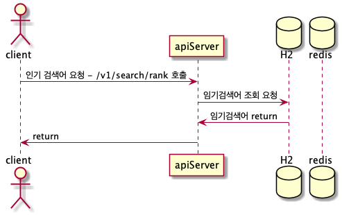

- local 환경 실패시
    - local server: 8080 port 확인
    - redis local server: 3306 port 확인

### 어플리케이션 다운로드

- 깃헙 [다운로드 링크](https://github.com/greenpkj/greenpkj/blob/master/task-0.0.1-SNAPSHOT.jar)
- 구글 [다운로드 링크](https://drive.google.com/file/d/1KCzlRPttPbR03c728fvbaf6FUe0kVsSX/view?usp=sharing)

### api 명세서
- [ Api 문서 ](https://htmlpreview.github.io/?https://github.com/greenpkj/greenpkj/blob/master/apidocs.html)

api 명세는 Rest Docs로 작성하였습니다.


## 1. API description

### api 블로그 검색 조회
- 검색 후 dto return 전에 데이터 저장 분리 - EventListener, ApplicationEventPublisher 활용
- 외부 api 호출 실패시 resilience4j 도입 - fallback 수행


#### 시퀀스 다이어그램


### api 인기 검색어 목록 조회
- v1, v2로 따로 구현
- v1 : H2 db를 통해 데이터 핸들 ("/v1/search/rank")
- v2 : redis를 통해 데이터 핸들 ("/v2/search/rank")

#### 시퀀스 다이어그램

- /v1/search/rank



- /v2/search/rank


## 2. package 구조

blog
- client : 외부 api client
- dto : blog 검색 도메인 dto
- service : 비지니스 로직 수행

config
- error : common 에러 response, enum 에러코드
- exception : 커스텀 예외 exception

search
- dto : keyword rank 도메인 dto
- entity : DB entity
- listener : 이벤트 리스너 
- repository : DB dao
- service : 비니니스 로직 수행


## 3. 외부 라이브러리 및 오픈소스 사용 가능 
```gradle
//외부(카카오,네이버) API 조회 시 사용하기 위히 추가
org.springframework.cloud:spring-cloud-starter-openfeign

//카카오 api실패시 fallback으로 사용하기 위해 추가
org.springframework.cloud:spring-cloud-starter-circuitbreaker-resilience4j

//v2 api 인기 검색어 목록 테스트를 위한 embedded redis 추가,
'it.ozimov:embedded-redis:0.7.3'

//JPA와 함께 쓰기위해 추가
"com.querydsl:querydsl-jpa:${queryDslVesion}"

//restdoc과 swagger생성을 통시에 하기 위해 추가
'com.epages:restdocs-api-spec-mockmvc:0.16.2'

//restdoc 디펜던시
'org.springframework.restdocs:spring-restdocs-mockmvc'

//application.yml에 있는 카카오, 네이버 key 암호화를 위해 추가
'com.github.ulisesbocchio:jasypt-spring-boot-starter:3.0.4'

```

## 4. Test case

- BlogSearchClientTest
  - 카카오, 네이버 조회 정상 확인
- BlogSearchFallBackServiceTest
  - 카카오 조회 실패시 fallback수행(네이버 조회)
- BlogSearchControllerTest
  - 블로그검색 통합테스트
- AppExceptionHandlerTest
  - RestAdviceController 테스트
- ApplicationEventPublisherMockTest
  - eventPublish 정상 테스트
- BlogSearchEventListenerMockTest
  - mock test
- SearchEventRepositoryTest
  - dataJpaTest
- SearchEventRedisServiceAtomicTest
  - redis 검색 hit 동시성 테스트
- SearchEventServiceMockTest
  - mock test
- SearchRankServiceMockTest
  - mock test
- SearchEventControllerTest
  - 인기검색어 통합테스트

## 5. TODO
1. TestContainers 도입
- 현재는 H2 DB와 embedded-redis를 쓰고 있지만 실제 개발환경에서는 쓰이지 않음
- 위를 도입을 통해 여러 디펜던시가 걸려있는 DB, Redis, Kafka 등등 테스트코드를 더 안전하게 짤수 있다.

2. KsqlDb 또는 카프카 스트림 활용
- 인기검색어 목록을 카프카 스트림 또는 KsqlDb를 활용하여 대체

3. 인기검색 개선
- 실제 인기검색 api를 user들에게 제공하게 될 경우 특정 기간(ex: 1분) 캐싱해서 처리진행